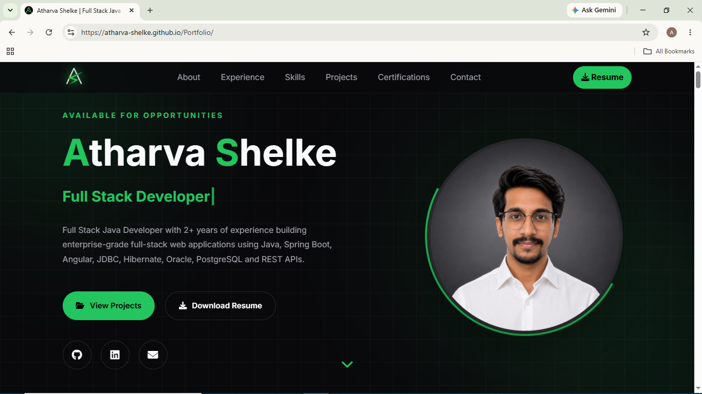

# 🌐 Personal Portfolio Website


A modern, fully responsive developer portfolio showcasing my professional experience, technical skills, featured projects, certifications, and contact information. The website emphasizes clean UI, smooth animations, and performance while maintaining a professional aesthetic suitable for recruiters and employers.

---

## 🚀 Live Demo

🔗 https://atharva-shelke.github.io/Portfolio/

---

## ✨ Features

- Modern dark-themed UI with green accent color
- Fully responsive across desktop, tablet and mobile devices
- Smooth scrolling navigation
- Active navigation highlighting while scrolling
- Scroll reveal animations
- Featured project showcase
- Project gallery with GitHub and live demo links
- Interactive certification cards
- Professional experience timeline
- Skills categorized by technology stack
- Downloadable resume
- Contact section with external profile links
- Back-to-top floating button
- Optimized for recruiters and hiring managers

---

## 📸 Screenshots

### Home Page



---

## 🛠️ Built With

### Frontend

- HTML5
- CSS3
- JavaScript (ES6)

### Libraries

- Font Awesome
- Devicon

### Design

- CSS Grid
- Flexbox
- CSS Variables
- CSS Transitions & Animations
- Responsive Layout

---

## 📂 Project Structure

```
Portfolio/
│
├── assets/
│   ├── certificates/
│   ├── favicon/
│   ├── icons/
│   ├── images/
│   └── resume/
│
├── index.html
├── style.css
├── script.js
└── README.md
```

---

## 📌 Sections

- Hero
- About
- Professional Experience
- Technical Skills
- Featured Projects
- Certifications & Achievements
- Contact
- Footer

---

## 🎯 Highlights

- Professional portfolio designed specifically for software engineering opportunities.
- Showcases enterprise development experience alongside personal projects.
- Includes GitHub repositories, live demos, certifications, and technical expertise.
- Optimized for readability, accessibility, and responsive viewing.

---

## 📱 Responsive Design

The website has been optimized for:

- Desktop
- Laptop
- Tablet
- Mobile Devices

---

## 🚀 Running Locally

Clone the repository

```bash
git clone https://github.com/Atharva-Shelke/Portfolio.git
```

Navigate to the project

```bash
cd Portfolio
```

Open `index.html` in your browser

or use VS Code Live Server.

---

## 🎨 Customization

You can easily customize the portfolio by updating:

- Personal information
- Resume
- Social links
- Projects
- Skills
- Certifications
- Color theme
- Images and icons

